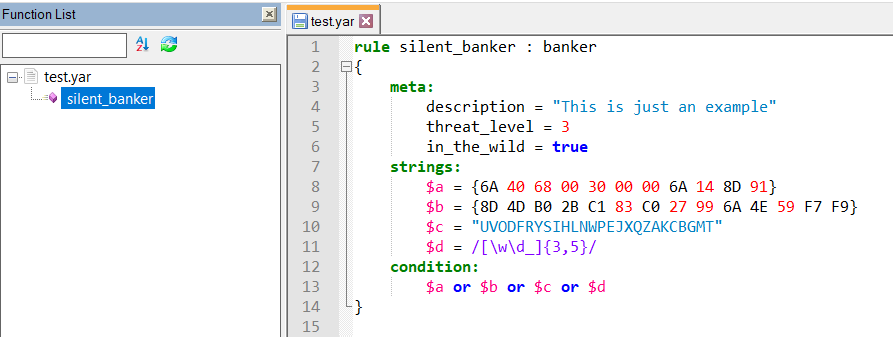

# YaraNpp



Добавить подсветку синтаксиса Yara в Notepad++ можно двумя способами:
1. скопировать my_yara.udl.xml в `%APPDATA%\Notepad++\userDefineLangs`
2. в notepad++ через меню Language -> User Defined Language -> Define your language -> Import и путь до .xml файла.

Чтобы научить Notepad++ отображать имена правил в окне "Function list" нужно скопировать my_yara.xml в C:\Program Files\Notepad++\functionList.
И добавить строку

```<association id= "my_yara.xml"   userDefinedLangName="MyYara"/>```

в `C:\Program Files\Notepad++\functionList\overrideMap.xml`
